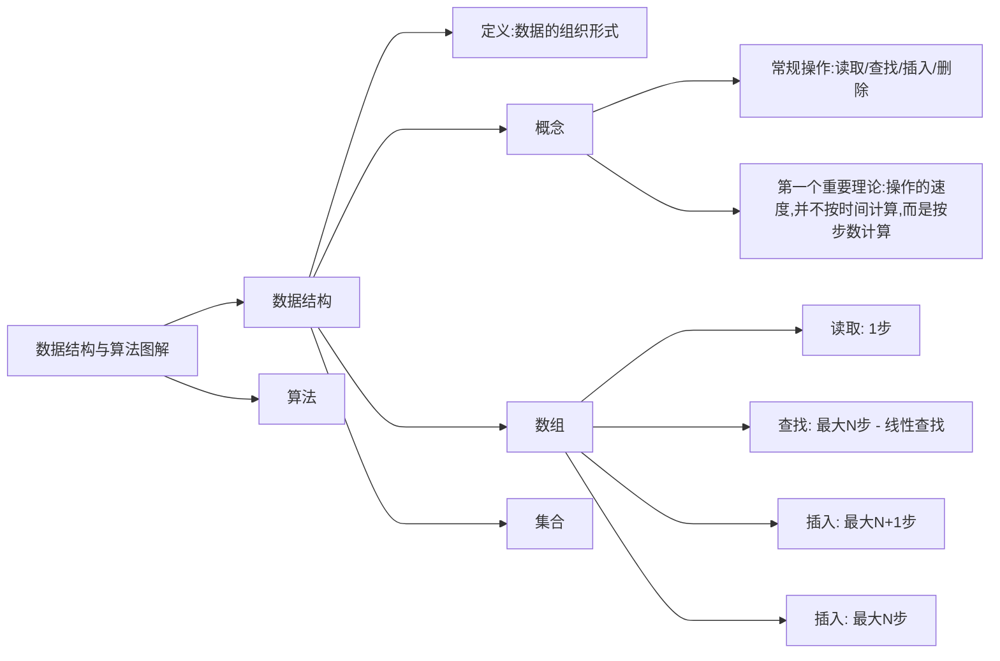

```mermaid
flowchart LR
    N[数据结构与算法图解] --> N1[数据结构]
    N1 ---> N1.1[定义:数据的组织形式]
    N1 ---> N1.2[概念]
    N1.2 ---> N1.2.1[常规操作:读取/查找/插入/删除]
    N1.2 ---> N1.2.2[第一个重要理论:操作的速度,并不按时间计算,而是按步数计算]
    N1 ---> N1.3[数组]
    N1.3 ---> N1.3.2[读取: 1步]
    N1.3 ---> N1.3.3[查找: 最大N步 - 线性查找]
    N1.3 ---> N1.3.4[插入: 最大N+1步]
    N1.3 ---> N1.3.5[插入: 最大N步]
    N1 ---> N1.4[集合]
    N --> N2[算法]
```
